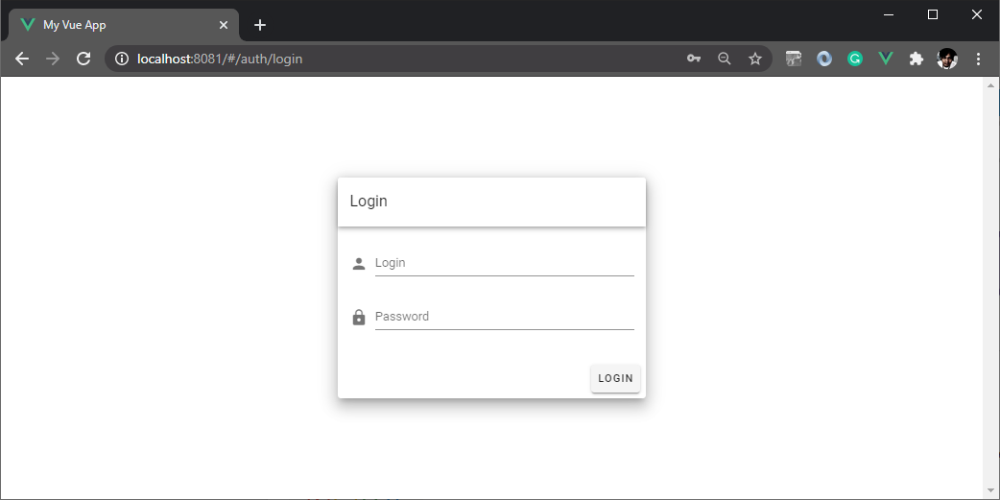
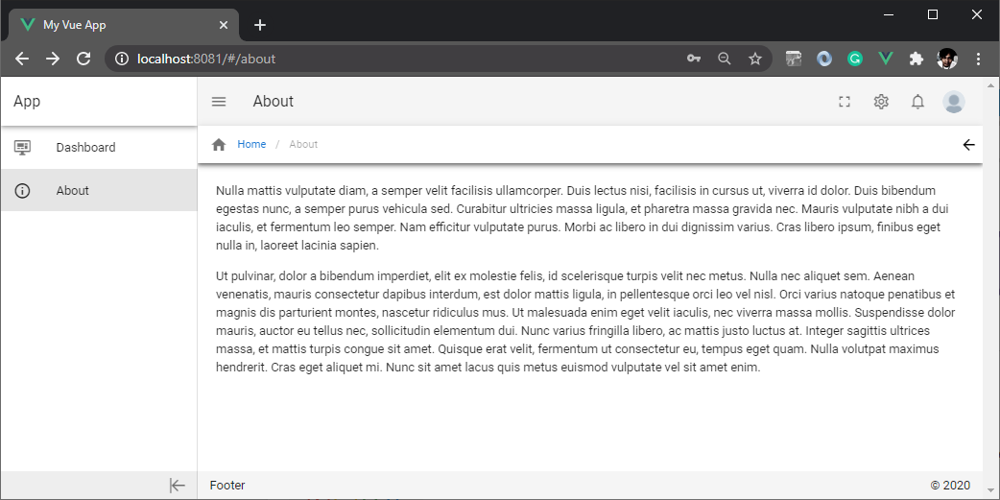

# Vue Vuetify Boilerplate

An up to date boilerplate for those who wishes to have a Vuetify baseline layout that has App Drawer, App Toolbar, App Footer and Content Area.
Includes a Login Page using Vuetify centered layout. 

Who is it for? It's for those who wish to have a baseline app, admin template app or starting point for implementing Vue, Vue-Router, Vuetify projects that incorporates application drawer, toolbar, footer and content area. (e.g. common usage and examples are Admin Apps). Perfect for Vue and Vuetify-beginners that wish to have a playground to apply code snippets captured from [Vuetify's Documentation](https://vuetifyjs.com/en/introduction/why-vuetify/#guide).

One of the goals for this boilerplate is to ensure that there's no outdated packages and to ensure to install the shiny new versions.

#

## Login


## Dashboard


## Project setup
``` bash
# clone this repo
git clone https://github.com/meteorbites/vue-vuetify-admin-boilerplate.git
```

``` bash
# install dependencies
yarn install

# or
npm install
```

### Compiles and hot-reloads for development
``` bash
# to run and serve the program
yarn serve

# or
npm run serve
```

### Compiles and minifies for production
``` bash
# to build for production
yarn build

# or
npm run build
```

### Lints and fixes files
```
yarn lint
```

### Customize configuration
See [Configuration Reference](https://cli.vuejs.org/config/).
